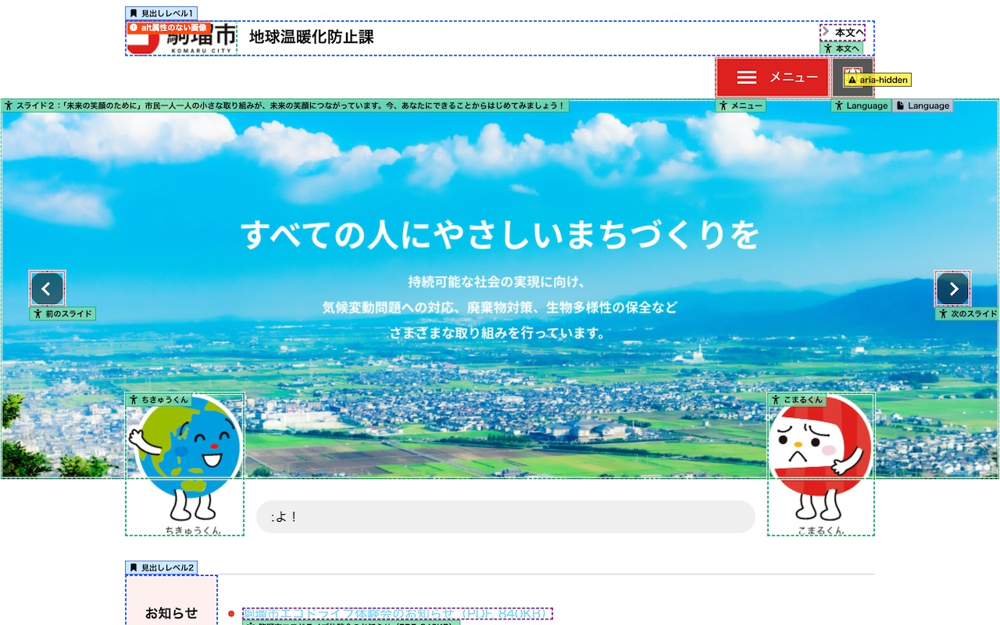

# Accessibility Visualizer Browser Extension


(This screenshot from [駒瑠市〜アクセシビリティ上の問題の体験サイト〜](https://a11yc.com/city-komaru/))

## Install

- [Chrome Web Store](https://chromewebstore.google.com/detail/accessibility-visualizer/idcacekakoknnpbfjcdhnkffgfbddnhk)
- [Firefox Add-ons](https://addons.mozilla.org/ja/firefox/addon/accessibility-visualizer/)

## Users' Guide

- [Accessibility Visualizer ユーザーズガイド (Japanese)](./docs/ja/UsersGuide.md)
- [Accessibility Visualizer User's Guide (English)](./docs/en/UsersGuide.md)
- [Accessibility Visualizer 사용자 가이드 (Korean)](./docs/ko/UsersGuide.md)

## How to develop

It is built with [CRXJS Vite Plugin](https://crxjs.dev/vite-plugin/).

To develop extension, lauch the dev server

```
# Install dependencies
$ pnpm install

# To testing, load the ./dist directory on your browser
# Currently it doesn't work in Firefox
$ pnpm dev

```

And in your browser, turn on Developer mode, and load the `dist` directory with "Load unpacked" button.

There is a test page in `src/test/` directroy. You can use it to test the extension with http://localhost:5173/src/test/index.html .

## How to build

```
# Install dependencies
$ pnpm install

# Build browser extensions to ./dist (for Chrome) and ./dist-firefox directory
# To testing, load the directories on your browser
$ pnpm build

# Build zip files to upload to the stores
# The zip files are created as ./a11y-visualizer-chrome.zip and ./a11y-visualizer-firefox.zip
$ pnpm package
```
