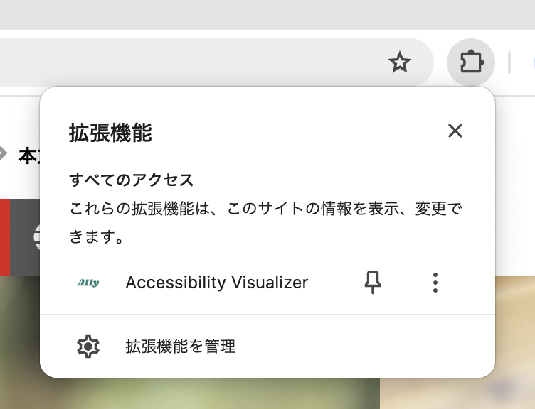
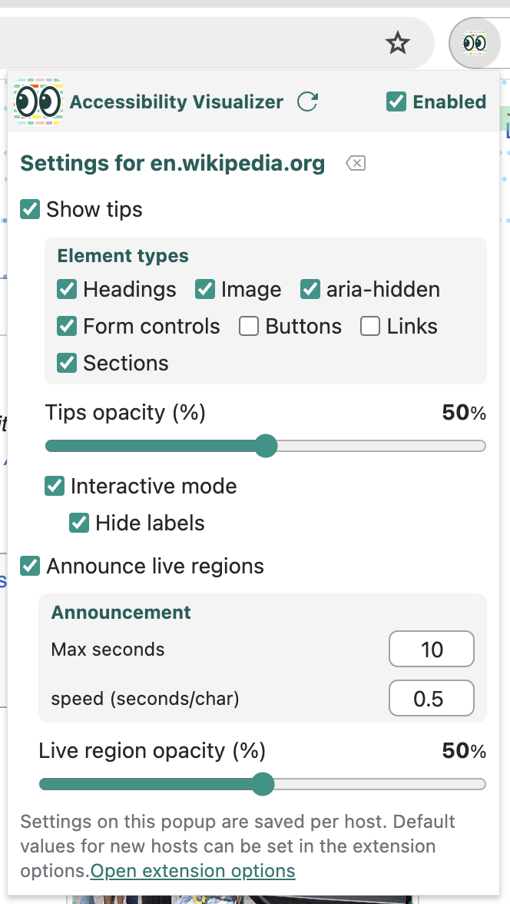
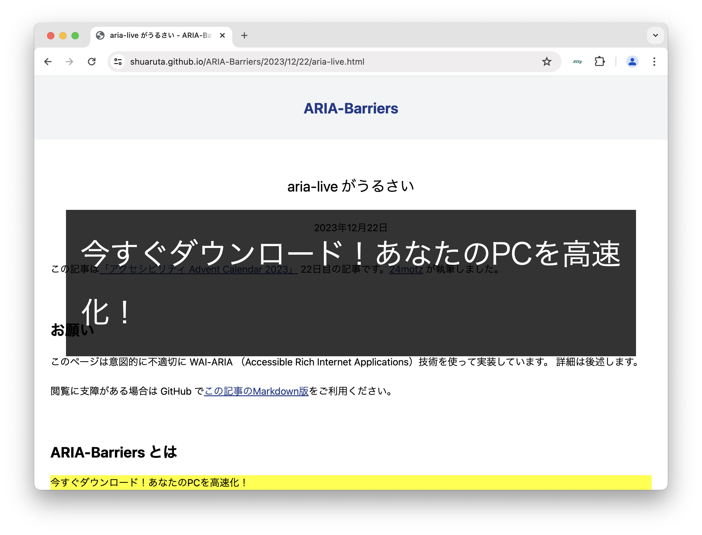

# Accessibility Visualizer User's Guide

## Introduction

Thank you for your interest in Accessibility Visualizer.
Accessibility Visualizer is a browser extension that aims to visualize important but visually invisible information to improve the accessibility of web pages.
It is currently distributed for Google Chrome at [Chrome Web Store](https://chromewebstore.google.com/detail/accessibility-visualizer/idcacekakoknnpbfjcdhnkffgfbddnhk) and for Mozilla Firefox at [Firefox Add-Ons](https://addons.mozilla.org/ja/firefox/addon/accessibility-visualizer/).

## What you can do with Accessibility Visualizer

- Display image alt text, heading levels, form labeling, table structure, list elements, language attributes, WAI-ARIA information, and more as overlays on web pages
- Display warning and error messages for clearly problematic states and states that should be used with caution
- Visually notify changes in live regions created by `role="status"`, `role="alert"`, `role="log"`, `aria-live` attributes, and `<output>` elements
- Easily switch between different types of information to display according to usage with the preset feature
- Save different settings for each domain and maintain appropriate display settings for each site

Until now, this information could only be verified by reading the accessibility tree (Accessibility Object Model) in the browser's developer tools, reading the source code, or actually operating with a screen reader.

Knowledge is required to read the accessibility tree and source code. Screen readers are unfamiliar to most people and their unique operation methods can be confusing.
The goal of Accessibility Visualizer is to visualize this information to eliminate these barriers and enable everyone to be aware of accessibility when coding or checking operation.

Note: Accessibility Visualizer **does not completely eliminate the need for verification with actual assistive technologies such as screen readers**. The information displayed by Accessibility Visualizer is supplementary and may cause you to miss critical issues. **We recommend combining screen reader verification** for incorporating into web development workflows.

## How to use Accessibility Visualizer

After installing Accessibility Visualizer, an Accessibility Visualizer item will appear in the extension menu.
If you use it frequently, we recommend pinning it to your browser's toolbar. When pinned to the toolbar, the Accessibility Visualizer icon will always be displayed.

When you click the Accessibility Visualizer item in the extension menu or the Accessibility Visualizer icon pinned to the toolbar, the Accessibility Visualizer popup opens.

There is an "Enabled" checkbox in the popup. If you uncheck it, no information will be displayed on web pages.

### Tips Display

When you check the "Show tips" checkbox, various information will be displayed as "tips" on the web page you are viewing.

(The screenshots is from [たいへんな駒瑠市 (Very difficult Komaru City)](https://a11yc.com/city-komaru/practice/?preset=ng-terrible1&wcagver=22) of [駒瑠市〜アクセシビリティ上の問題の体験サイト〜 (Komaru City - Experience site for accessibility issues -)](https://a11yc.com/city-komaru/))

When you check the "Interactive" checkbox, tips will appear subdued until you mouse over them.

#### Presets

You can easily switch the targets for which tips are displayed using the preset feature.

- **Basic preset**: Display headings, images, form controls, buttons, links, page, language, and WAI-ARIA information
- **Structure preset**: Display headings, sections, page, and language information
- **Content preset**: Display images, links, tables, and lists
- **Custom**: Freely select which information to display

### Live Region Announcements

When "Announce live regions" is checked in the popup, changes to [ARIA live regions](https://developer.mozilla.org/en/docs/Web/Accessibility/ARIA/ARIA_Live_Regions) will be displayed near the center of the screen.
This is a feature for experiencing and verifying the operation of live regions used to convey screen state changes to users of assistive technologies such as screen readers, without using screen readers or other assistive technologies.

(The screenshot is from ["aria-live がうるさい (aria-live is noisy)" (ARIA-Barriers)](https://shuaruta.github.io/ARIA-Barriers/2023/12/22/aria-live.html), which displays the announcement. )

#### Live Region Controls

- **Shift key**: Toggle pause/resume
- **Ctrl key**: Clear displayed announcements

### Display Customization

You can customize the display settings for tips and live region announcements displayed on web pages through the popup settings.

- **Hide labels in interactive mode**: In interactive mode, tips will show only icons until you mouse over them
- **Tips opacity**: Adjustable from 0-100% with slider (default 30%)
- **Tip font size**: Specify with number (default 10px)
- **Live region opacity**: Adjustable from 0-100% with slider (default 50%)
- **Live region font size**: Specify with number (default 48px)
- **Max announcement length**: Specify upper limit of display time in seconds (default 10 seconds)
- **Speed**: Specify display time per character in seconds (default 0.5 seconds)

## Usage Notes

- Tip display positions may frequently shift. In such cases, press the "Re-run" button in the popup
- Some websites may become slow when displaying tips or announcements. For such sites, uncheck "Show tips" and "Announce live regions"
  - For some sites that inevitably become slow, the extension developers may take measures to prevent operation
- In areas using frames or Shadow DOM, tips and live regions may not be displayed due to technical constraints
- Interactive mode may interfere with mouse operations on web pages

## Detailed Tip Display

Here we briefly explain the information displayed in tips and the points to check.

Tips come in the following types:

- Name: Displayed in green with a person icon
- Warning: Displayed in yellow with a warning triangle icon. Indicates areas that may have problems
- Error: Displayed in red with an error triangle icon. Indicates areas that definitely have problems
- Description: Displayed in gray with a document icon
- Heading: Displayed in blue with a bookmark icon, indicating heading level
- Table Header: Displayed in blue with a table icon, showing corresponding table header content
- Landmark: Displayed in yellow-green with a flag icon, indicating landmark type
- List Type: Displayed in yellow-green with a circled list icon. Indicates list type
- List: Displayed in orange with a list icon. Shows number of list items
- Link Target: Displayed in orange with an "open in other tab" icon
- Table Size: Displayed in orange with a table icon, showing number of table rows and columns
- Table Cell Position: Displayed in orange with a pin icon, showing cell position within table
- Language: Displayed in yellow with a text icon
- Page Title: Displayed with a window icon
- Role: Displayed in pink with a tag icon
- Element: Displayed in purple with HTML tag-like `</>` icon
- Status: Displayed in orange with an info icon
- WAI-ARIA attribute: Displayed in orange with a gear icon

"Name" displays the value of "[Accessible Name](https://developer.mozilla.org/en/docs/Glossary/Accessible_name)" and "Description" displays the value of "[Accessible Description](https://developer.mozilla.org/en/docs/Glossary/Accessible_description)". These are information used by users of assistive technologies such as screen readers to recognize elements.

### Images

When "Images" is checked, tips are displayed for `` elements, `<svg>` elements, and elements with `role="img"` attribute.

- Name tips display so-called alt text (alternative text)
  - Alt text for images should be concise descriptions with content that conveys almost the same information even when displayed instead of the image
  - For `` elements, the `alt` attribute is typically used
  - For `<svg>` elements, `<title>` elements, `aria-label` attributes, or `aria-labelledby` attributes may be used
  - For elements with `role="img"` attribute, `aria-label` attributes or `aria-labelledby` attributes may be used
- For `` elements with `alt=""`, a warning tip "Image with alt=\"\"" is displayed. Images in this state cannot be perceived by assistive technologies such as screen readers. **Unless this image is placed for decorative purposes, add alt text**
- If no alt text is specified and it's not `aria-hidden` or `alt=""`, **an error tip "Image without alt attribute" or "No name (label)"** is displayed. In this case, **correction is required**

### Buttons

When "Buttons" is checked, tips are displayed for `<button>` elements, `<input>` elements with `type` attribute of `button`, `submit`, `reset`, or `image`, and elements with `role="button"` attribute.

- Name tips display button labels. Check for completeness and appropriate labeling.
- If no name is given, **an error tip "No name (label)"** is displayed. In this case, assistive technologies such as screen readers cannot predict button behavior. **Correction is required**
- For elements with `role="button"` attribute that are not focusable by default and have no `tabindex` attribute specified, **an error tip "Not focusable"** is displayed. In this state, keyboard operation is not possible, so **correction is required**

### Links

When "Links" is checked, tips are displayed for `<a>` elements, `<area>` elements, and elements with `role="link"` attribute.

- Name tips display link text. Check for completeness and appropriate text.
- If the link name becomes empty, **an error tip "No name (label)"** is displayed. In this case, assistive technologies such as screen readers cannot perceive the link purpose. **Correction is required**
- For `<a>` or `<area>` elements without `href` attribute, browsers don't treat them as links. A warning tip "No href attribute" is displayed. If click interactions are set on `<a>` elements in this state, there may be issues with keyboard operation or users of assistive technologies may not recognize them as interactive targets. **In such cases, correction is required**

### Form Controls

When "Form Controls" is checked, tips are displayed for `<input>` elements with `type` attribute other than `hidden`, `button`, `submit`, `reset`, `image`, `<textarea>` elements, `<select>` elements, `<label>` elements, `<fieldset>` elements, and elements with `role` attribute specified as `textbox`, `combobox`, `checkbox`, `radio`, `switch`, `menuitemcheckbox`, or `menuitemradio`.

- Name tips display form control labels. Check for completeness and appropriate labeling.
  - Typically, `<label>` elements are used for `<input>`, `<select>`, `<textarea>` elements
- If no name is given, **an error tip "No name (label)"** is displayed. In this case, assistive technologies such as screen readers cannot perceive the form control purpose. **Correction is required**
- For elements that are not focusable by default and have no `tabindex` attribute specified, **an error tip "Not focusable"** is displayed. In this state, keyboard operation is not possible, so **correction is required**
- For radio buttons (`<input type="radio">`) without the same `name` attribute, **an error tip "No name attribute"** is displayed. If there are no radio buttons with the same `name` attribute within the same `<form>` element or document, **an error tip "No radio button group"** is displayed. These indicate that radio button grouping is not done properly, which may prevent keyboard selection, make Tab key navigation unpredictable, and make it impossible to recognize which radio buttons are in the same group. **Correction is required**
- For `<label>` elements where the associated form control doesn't exist or is hidden, **a warning tip "Label without form control"** is displayed. Especially when hiding for styling checkboxes or radio buttons, there's a high possibility of making them non-keyboard operable. **Check** if `display:none`, `visibility:hidden`, etc. are being used

### Headings

When "Headings" is checked, tips are displayed for `<h1>` to `<h6>` elements and elements with `role="heading"` attribute.

- Heading level tips display heading levels. Check if appropriate levels are used.
  - `<h1>` to `<h6>` elements are used to indicate heading levels
  - For elements with `role="heading"` attribute, `aria-level` attribute is used to indicate heading level
- For elements with `role="heading"` attribute without `aria-level` attribute, **an error tip "No heading level"** is displayed. In this case, assistive technologies such as screen readers cannot perceive heading levels. **Correction is required**
- Name tips display heading text. Check for completeness and appropriate text.
- If no name is given to headings, **an error tip "No name (label)"** is displayed. In this case, assistive technologies such as screen readers cannot perceive headings. **Correction is required**

### Sections

When "Sections" is checked, tips are displayed for `<article>`, `<section>`, `<nav>`, `<aside>`, `<main>`, `<form>`, `<search>` elements and elements with role attributes of `article`, `banner`, `complementary`, `contentinfo`, `main`, `form`, `navigation`, `region`, `search`, `application`.

These elements are used to divide page content into sections, helping users of assistive technologies understand page structure and skip unwanted content.

- Landmark tips display landmark names corresponding to `role` attribute values. If displayed, check if the role is appropriate
- If accessible names are given by any method, name tips display section names. If displayed, check if the name is appropriate. Also check that no landmarks with the same name and role exist on the page.

### Page

When "Page" is checked, tips are displayed for page-wide or document-level information.

- You can check if page titles are set appropriately
- Information about overall document structure is displayed

### Language

When "Language" is checked, tips are displayed for elements with `lang` attribute.

- Element tips display language codes
- You can also check page-wide language settings (`<html lang="...">`)
- Check if languages are set appropriately. Language settings are important for screen readers to read with correct pronunciation

### Tables

When "Tables" is checked, tips are displayed for `<table>` elements and related elements.

- Table size (rows × columns) is displayed
- You can check the presence and settings of table headers (`<th>` elements)
- Position information (row number, column number) for each cell is displayed
- You can check the presence of table captions with `<caption>` elements
- For complex tables, check if proper associations between headers and cells are made

### Lists

When "Lists" is checked, tips are displayed for `<ul>`, `<ol>`, `<dl>` elements and their list items.

- List type (unordered, ordered, definition list) is displayed
- Position and numbers of list items are displayed
- You can check hierarchical structure of nested lists
- Check if lists are properly marked up

### WAI-ARIA

When "WAI-ARIA" is checked, tips are displayed for elements with ARIA attributes.

- WAI-ARIA attribute tips display the names and values of ARIA attributes on elements. These help you understand which ARIA attributes are applied and verify their values
- Warning tips are displayed for elements with `aria-hidden="true"` attribute. Elements with this attribute are not perceived by users of assistive technologies such as screen readers. If elements other than decorative ones are visually visible but have `aria-hidden`, **correction is required**
- States of other ARIA attributes (`aria-expanded`, `aria-selected`, etc.) are displayed
- Role tips display custom roles
- Check if ARIA attributes are set appropriately and behave as expected

## Using with Other Verification Tools

Accessibility Visualizer can be used alongside the following tools for more comprehensive accessibility verification:

- [axe DevTools](https://www.deque.com/axe/devtools/)
- [WAVE](https://wave.webaim.org/)
- [Lighthouse](https://developer.chrome.com/docs/lighthouse/overview)

Additionally, **verification with actual screen readers should be performed** alongside verification using these tools. Accessibility Visualizer is a tool for improving development efficiency, but it does not completely replace verification with actual assistive technologies.
