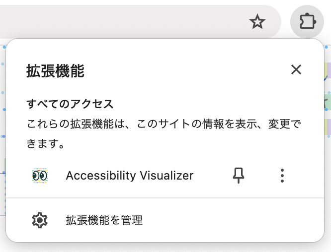
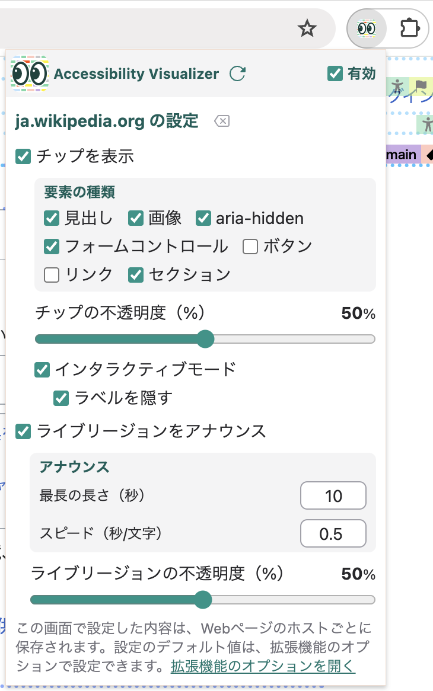
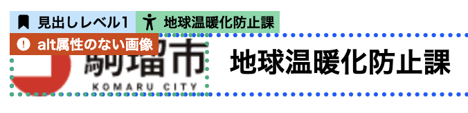

# Accessibility Visualizer ユーザーズガイド

## はじめに

Accessibility Visualizerに興味を持っていただき、ありがとうございます。
Accessibility Visualizerは、Webページのアクセシビリティを向上するために重要だが、視覚的に見えない情報を可視化することを目的とした、ブラウザ拡張機能です。
現在はGoogle Chrome向けに、[Chromeウェブストア](https://chromewebstore.google.com/detail/accessibility-visualizer/idcacekakoknnpbfjcdhnkffgfbddnhk)で配布しています。

## Accessibility Visualizerでできること

- 画像の代替テキスト、見出しレベル、フォームのラベル付けなどの状況を、Webページにオーバーレイして表示することができます
- これらのうち、明らかに問題のある状態であるもの、注意深く使用するべきものについては、警告文を表示します
- `role="status"` `role="alert"` `role="log"` `aria-live`属性、 `<output>` 要素によって作成されるライブリージョンの変化を視覚的な表示として通知します

これまで、これらの情報は、ブラウザの開発者ツールでアクセシビリティツリー（アクセシビティオブジェクトモデル）を読み解くか、ソースコードを読み解くか、スクリーンリーダーで実際に操作する以外に正しく実装されているかを確認する方法がありませんでした。

アクセシビリティツリーを読み解くのも、ソースコードを読み解くのも知識を必要とします。スクリーンリーダーはほとんどの人にとって馴染みがなく、独特の操作方法に戸惑うでしょう。
これらの情報を可視化することで、それらの障壁をなくし、誰もがコーディング時や動作確認時にアクセシビリティを意識できるようにすることが、Accessibility Visualizerの狙いです。

注意: Accessibility Visualizerは、スクリーンリーダーなどの **実際の支援技術による確認作業を完全に不要にするものではありません** 。Accessibility Visualizerの表示する情報は補助的なものであり、重大な問題を見落としてしまう可能性があります。Web開発の作業フローへの導入には、 **スクリーンリーダーによる確認を併用することをお勧めします**。

## Accessibilty Visualizerの使い方

Accessibility Visualizerをインストールすると、拡張機能メニュー内にAccessibility Visualizerの項目が出現します。
よく使う場合は、ブラウザのツールバーへ固定表示することをお勧めします。ツールバーに固定表示すると、Accessibility Visualizerのアイコンが常時表示されます。

拡張機能メニュー内にAccessibility Visualizerの項目、またはツールバーに固定表示したAccessibility Visualizerのアイコンをクリックすると、Accessibility Visualizerのポップアップが開きます。

### チップの表示

ポップアップ内の、「チップを表示」チェックボックスにチェックを入れると、閲覧中のWebページに「チップ」として、さまざまな情報が表示されるようになります。

（スクリーンショットは、[駒瑠市〜アクセシビリティ上の問題の体験サイト〜](https://a11yc.com/city-komaru/)の「[たいへんな駒瑠市](https://a11yc.com/city-komaru/practice/?preset=ng-terrible1&wcagver=22)でチップを表示したもの）

チップを表示する対象は、ポップアップ内のチェックボックスで変更することができます。特定の対象を詳しく確認したり、出したままだとWebブラウジングがしづらい場合は、チェックを外して調整してください。

- 画像
- ボタン
- リンク
- フォームコントロール
- 見出し
- aria-hidden

「チップの不透明度」のスライダーで、チップの表示の色の濃さを調整することができます。表示が邪魔な場合は不透明度を下げてください。

#### チップの表示の注意点

- チップの表示位置はしばしばズレることがあります。その場合は、ポップアップ内の「再表示」ボタンを押してください
- チップを表示していると動作が重くなってしまうWebサイトがあります。そういったサイトを閲覧する場合は「チップを表示」のチェックを外してください
- フレームを使用している箇所では、技術的な制約からチップの表示ができないことがあります

## ライブリージョンのアナウンス

ポップアップ内の「ライブリージョンをアナウンス」にチェックを入れていると、[ARIAライブリージョン](https://developer.mozilla.org/ja/docs/Web/Accessibility/ARIA/ARIA_Live_Regions)に変化があった場合に、その内容が画面中央付近に表示されるようになります。
これは、スクリーンリーダー等の支援技術のユーザーに対して、画面の状態の変化などを伝えるために使われるライブリージョンの機能を、スクリーンリーダー等を使わずに体験・動作を確認するための機能です。

（スクリーンショットは[aria-live がうるさい (ARIA-Barriers)](https://shuaruta.github.io/ARIA-Barriers/2023/12/22/aria-live.html)で、アナウンスを表示したもの）

ライブリージョンのアナウンスは、その文字数が多いほど、長時間表示されるようになっています。
ポップアップ内で、1文字あたりの秒数と、アナウンスの最長の長さを変更できるようになっています。ライブリージョンのアナウンスが邪魔な場合は、それぞれの数値を小さく調整してください。
また、ライブリージョンのアナウンスの表示の色の濃さも変更することができます。

### ライブリージョンのアナウンスの注意点

- アナウンスを表示していると動作が重くなってしまうWebサイトがあります。そういったサイトを閲覧する場合は「ライブリージョンをアナウンス」のチェックを外してください
- フレームを使用している箇所では、技術的な制約からライブリージョンのアナウンスができないことがあります

## チップ表示の詳細

ここでは、チップで表示される情報について、確認するべきポイントを簡単に説明します。

チップには、以下の種類があります

- 名前: 緑色で、人型のアイコンとともに表示されます。内容が適切かどうか、抜け漏れがないかを確認してください
- 説明: 灰色で、書類のアイコンとともに表示されます。内容が適切かどうか、抜け漏れがないかを確認してください
- 見出し: 青色で、ブックマークのアイコンとともに表示されます。見出しのレベルが適切かどうかを確認してください
- 警告: 黄色で、警告の三角形のアイコンとともに表示されます。問題があるかもしれない箇所を示しています
- エラー: 赤色で、エラーの三角形のアイコンとともに表示されます。確実に問題のある箇所を示しています
- ロール: ピンク色で、荷札のアイコンとともに表示されます
- 要素: 茶色で、 HTMLタグを模した `</>` のアイコンとともに表示されます

「名前」は「[アクセシブルな名前 (Accessible Name)](https://developer.mozilla.org/ja/docs/Glossary/Accessible_name)」、「説明」は「[アクセシブルな説明 (Accessible Description)](https://developer.mozilla.org/ja/docs/Glossary/Accessible_description)」の値が表示されます。これらは、スクリーンリーダー等の支援技術のユーザーが、その要素を認識するために使われる情報です。

### 画像

「画像の情報を表示」のチェックが入っているとき、`` 要素、`<svg>` 要素、`role="img"` 属性をもつ要素に対してチップを表示します。

- 名前チップで、いわゆる代替テキスト（altテキスト）が表示されます
  - 画像の代替テキストは、画像がのかわりに表示されてもほとんど同じ情報が伝わるような内容で、簡潔な説明であることが望ましいとされています
  - `` 要素の場合、通常は `alt` 属性が使われます
  - `<svg>` 要素の場合、`<title>` 要素や `aria-label` 属性、 `aria-labelledby` 属性が使われることがあります
  - `role="img"` 属性をもつ要素の場合、`aria-label` 属性、 `aria-labelledby` 属性が使われることがあります
- `` 要素で `alt=""` としている場合には、「alt=""の画像」という警告チップが表示されます。この状態の画像は、スクリーンリーダー等の支援技術では存在を知覚できません。**この画像が装飾目的で配置されている場合以外は、代替テキストを付けてください**
- 代替テキストの指定がなく、`aria-hidden`または `alt=""` でもない場合、 **「alt属性のない画像」または「名前（ラベル）なし」のエラーチップ** が表示されます。この場合は、 **修正が必要です**

### ボタン

「ボタンの情報を表示」のチェックが入っているとき、`<button>` 要素、 `type` 属性が `button` `submit` `reset` `image` の `<input>`要素、 `role="button"` 属性をもつ要素に対してチップを表示します。

- 名前のチップで、ボタンのラベルが表示されます。抜け漏れの有無や適切なラベルになっているかを確認してください。
- 名前が与えられていない場合、 **「名前（ラベル）なし」のエラーチップ** が表示されます。この場合は、スクリーンリーダー等の支援技術ではボタンの挙動を予測できません。 **修正が必要です**
- `role="button"` 属性をもつ、標準ではフォーカスできない要素で、`tabindex` 属性が指定されていない場合、 **「フォーカスできない」のエラーチップ** が表示されます。この状態ではキーボードで操作できないため、 **修正が必要です**

### リンク

「リンクの情報を表示」のチェックが入っているとき、`<a>` 要素、 `<area>` 要素、 `role="link"` 属性をもつ要素に対してチップを表示します。

- 名前のチップで、リンクのテキストが表示されます。抜け漏れの有無や適切なテキストになっているかを確認してください。
- リンクの名前が空になってしまう場合、 **「名前（ラベル）なし」のエラーチップ** が表示されます。この場合は、スクリーンリーダー等の支援技術ではリンクの目的を知覚できません。 **修正が必要です**
- `<a>` 要素や `<area>` 要素で `href` 属性がない場合、ブラウザはリンクとして扱いません。「href属性なし」の警告チップが表示されます。この状態の `<a>` 要素にクリックなどによるインタラクションが設定されている場合、キーボード操作ができなかったり、スクリーンリーダー等の支援技術のユーザーが操作対象であることを認識できないおそれがあります。 **その場合は修正が必要です**

### フォームコントロール

「フォームコントロールの情報を表示」のチェックが入っているとき、`type` 属性が `hidden` `button` `submit` `reset` `image` 以外の `<input>` 要素、`<textarea>`要素、 `<select>` 要素、 `role` 属性に `textbox` `combobox` `checkbox` `radio` `switch` のいずれかが指定されている要素に対してチップを表示します。

- 名前のチップで、フォームコントロールのラベルが表示されます。抜け漏れの有無や適切なラベルになっているかを確認してください。
  - 通常、`<input>` `<select>` `<textarea>` 要素には、`<label>` 要素が使われます
- 名前が与えられていない場合、 **「名前（ラベル）なし」のエラーチップ** が表示されます。この場合は、スクリーンリーダー等の支援技術ではフォームコントロールの目的を知覚できません。 **修正が必要です**
- 標準ではフォーカスできない要素で、`tabindex` 属性が指定されていない場合、 **「フォーカスできない」のエラーチップ** が表示されます。この状態ではキーボードで操作できないため、 **修正が必要です**

### 見出し

「見出しの情報を表示」のチェックが入っているとき、`<h1>` から `<h6>` 要素と、 `role="heading"` 属性をもつ要素に対してチップを表示します。

- 見出しのレベルのチップで、見出しのレベルが表示されます。適切なレベルになっているかを確認してください。
  - `<h1>` から `<h6>` 要素は、見出しのレベルを示すために使われます
  - `role="heading"` 属性をもつ要素では、見出しのレベルを示すために `aria-level` 属性が使われます
- `role="heading"` 属性をもつ要素で、 `aria-level` 属性が存在しない場合、 **「見出しレベルなし」のエラーチップ** が表示されます。この場合は、スクリーンリーダー等の支援技術では見出しのレベルを知覚できません。 **修正が必要です**
- 名前のチップで、見出しのテキストが表示されます。抜け漏れの有無や適切なテキストになっているかを確認してください。
- 見出しに名前が与えられていない場合、 **「名前（ラベル）なし」のエラーチップ** が表示されます。この場合は、スクリーンリーダー等の支援技術では見出しを知覚できません。 **修正が必要です**

### aria-hidden

「aria-hiddenの情報を表示」のチェックが入っているとき、`aria-hidden="true"` 属性をもつ要素に対してチップを表示します。

- 警告のチップで、`aria-hidden="true"` 属性が存在することが表示されます。この属性が指定されている要素は、スクリーンリーダー等の支援技術のユーザーには知覚されません。 画面に表示されていてユーザーが知覚できる情報が存在するのに `aria-hidden="ture"` となっている場合は、スクリーンリーダー等の支援技術のユーザーのみがその情報を知覚できないことになります。装飾目的の要素以外で視覚的に見えているのに `aria-hidden` となっている要素が存在する場合は、 **修正が必要です**
