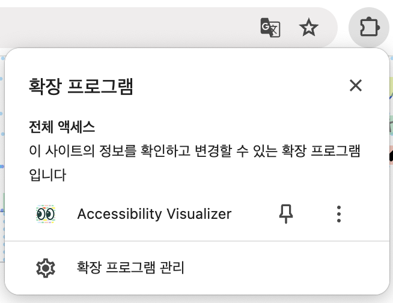
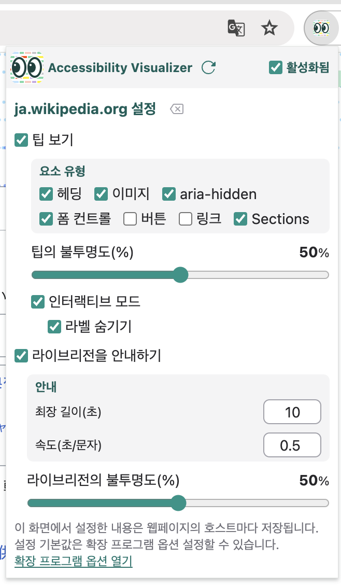
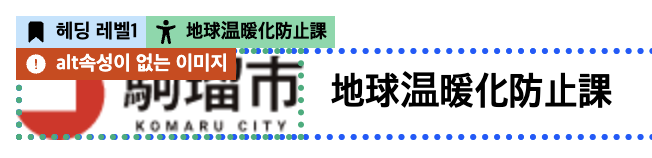

# Accessibility Visualizer 사용자 가이드

## 소개

Accessibility Visualizer에 관심을 가져주셔서 감사합니다.
Accessibility Visualizer는 웹페이지의 접근성을 향상시키기 위해 중요하지만 시각적으로 보이지 않는 정보를 시각화하는 것을 목적으로 한 브라우저 확장 프로그램입니다.
현재 Google Chrome용으로는 [Chrome 웹스토어](https://chromewebstore.google.com/detail/accessibility-visualizer/idcacekakoknnpbfjcdhnkffgfbddnhk), Firefox용으로는 [Firefox Add-Ons](https://addons.mozilla.org/ja/firefox/addon/accessibility-visualizer/)에서 배포되고 있습니다.

## Accessibility Visualizer로 할 수 있는 것

- 이미지의 대체 텍스트, 헤딩 레벨, 폼 라벨링, 테이블 구조, 리스트 요소, 언어 속성, WAI-ARIA 정보 등을 웹페이지에 오버레이로 표시할 수 있습니다
- 명백히 문제가 있는 상태나 주의 깊게 사용해야 할 상태에 대해서는 경고나 오류 메시지를 표시합니다
- `role="status"` `role="alert"` `role="log"` `aria-live` 속성, `<output>` 요소에 의해 생성되는 라이브 리전의 변화를 시각적 표시로 알려줍니다
- 프리셋 기능을 통해 용도에 따라 표시할 정보를 쉽게 전환할 수 있습니다
- 도메인별로 다른 설정을 저장하고, 사이트에 맞는 표시 설정을 유지할 수 있습니다

지금까지 이러한 정보는 브라우저의 개발자 도구에서 접근성 트리(접근성 객체 모델)를 분석하거나, 소스 코드를 분석하거나, 스크린 리더로 실제로 조작하는 것 외에는 올바르게 구현되었는지 확인할 방법이 없었습니다.

접근성 트리를 분석하는 것도, 소스 코드를 분석하는 것도 지식이 필요합니다. 스크린 리더는 대부분의 사람들에게 익숙하지 않으며, 독특한 조작 방법에 당황할 것입니다.
이러한 정보를 시각화함으로써 이러한 장벽을 없애고, 누구나 코딩이나 동작 확인 시에 접근성을 의식할 수 있도록 하는 것이 Accessibility Visualizer의 목표입니다.

주의: Accessibility Visualizer는 **스크린 리더 등 실제 보조 기술에 의한 확인 작업을 완전히 불필요하게 만드는 것은 아닙니다**. Accessibility Visualizer가 표시하는 정보는 보조적인 것이며, 중대한 문제를 놓칠 가능성이 있습니다. 웹 개발 워크플로에 도입할 때는 **스크린 리더에 의한 확인을 병행하는 것을 권장합니다**.

## Accessibility Visualizer 사용법

Accessibility Visualizer를 설치하면 확장 프로그램 메뉴에 Accessibility Visualizer 항목이 나타납니다.
자주 사용하는 경우 브라우저 툴바에 고정 표시하는 것을 권장합니다. 툴바에 고정 표시하면 Accessibility Visualizer 아이콘이 항상 표시됩니다.

확장 프로그램 메뉴의 Accessibility Visualizer 항목 또는 툴바에 고정 표시된 Accessibility Visualizer 아이콘을 클릭하면 Accessibility Visualizer 팝업이 열립니다.

팝업 내에 "사용" 체크박스가 있습니다. 체크를 해제하면 웹페이지에 정보 표시를 하지 않게 됩니다.

### 팁 표시

"팁 표시" 체크박스에 체크하면 보고 있는 웹페이지에 "팁"으로 다양한 정보가 표시됩니다.

(스크린샷은 [駒瑠市〜アクセシビリティ上の問題の体験サイト〜 (코마루시 〜접근성상의 문제 체험 사이트〜)](https://a11yc.com/city-komaru/) 의 [たいへんな駒瑠市(힘든 코마루시)](https://a11yc.com/city-komaru/practice/?preset=ng-terrible1&wcagver=22)에서 팁을 표시한 것)

"대화형" 체크박스에 체크하면 마우스를 올릴 때까지 팁이 절제된 표시로 나타납니다.

#### 프리셋

팁을 표시할 대상은 프리셋 기능으로 쉽게 전환할 수 있습니다.

- **기본 프리셋**: 헤딩, 이미지, 폼 컨트롤, 버튼, 링크, 페이지, 언어, WAI-ARIA 정보를 표시
- **구조 프리셋**: 헤딩, 섹션, 페이지, 언어 정보를 표시
- **콘텐츠 프리셋**: 이미지, 링크, 테이블, 리스트를 표시
- **커스텀**: 표시할 정보를 자유롭게 선택

### 라이브 리전 알림

팝업 내의 "라이브 리전을 안내"에 체크가 되어 있으면 [ARIA 라이브 리전](https://developer.mozilla.org/ko/docs/Web/Accessibility/ARIA/ARIA_Live_Regions)에 변화가 있을 경우 그 내용이 화면 중앙 부근에 표시됩니다.
이는 스크린 리더 등의 보조 기술 사용자에게 화면 상태 변화 등을 전달하기 위해 사용되는 라이브 리전의 기능을 스크린 리더 등을 사용하지 않고 체험·동작을 확인하기 위한 기능입니다.

(스크린샷은 ['aria-live がうるさい (aria-live가 시끄럽다)' (ARIA-Barriers)](https://shuaruta.github.io/ARIA-Barriers/2023/12/22/aria-live.html)에서 알림을 표시한 것)

#### 라이브 리전 조작

- **Shift 키**: 일시정지/재개 전환
- **Ctrl 키**: 표시되어 있는 알림을 클리어

### 표시 커스터마이징

웹페이지에 표시되는 팁이나 라이브 리전 알림의 표시 방법은 팝업 내 설정으로 커스터마이징할 수 있습니다.

- **대화형 모드에서 라벨 숨기기**: 대화형 모드 시에 마우스를 올릴 때까지 팁은 아이콘만 표시됩니다
- **팁 불투명도**: 슬라이더로 0-100%(기본값 30%)까지 조정 가능
- **팁 글자 크기**: 숫자로 지정(기본값 10px)
- **라이브 리전 불투명도**: 슬라이더로 0-100%(기본값 50%)까지 조정 가능
- **라이브 리전 글자 크기**: 숫자로 지정(기본값 48px)
- **알림 최대 길이**: 표시 시간의 상한을 초 단위로 지정(기본값 10초)
- **속도**: 1글자당 표시 시간을 초 단위로 지정(기본값 0.5초)

## 사용상 주의점

- 팁의 표시 위치가 자주 어긋날 수 있습니다. 그런 경우 팝업 내의 "재실행" 버튼을 누르세요
- 팁이나 알림을 표시하면 동작이 무거워지는 웹사이트가 있습니다. 그런 사이트를 보는 경우에는 "팁 표시", "라이브 리전을 안내" 체크를 해제하세요
  - 일부 어쩔 수 없이 무거워지는 사이트에 대해서는 확장 프로그램 개발자 측에서 동작하지 않도록 대응할 수 있습니다
- 프레임이나 Shadow DOM을 사용하는 곳에서는 기술적 제약으로 팁이나 라이브 리전 표시가 안 될 수 있습니다
- 인터랙티브 모드에서는 웹페이지의 마우스 조작을 방해할 수 있습니다

## 팁 표시 상세

여기서는 팁으로 표시되는 정보에 대해 확인해야 할 포인트를 간단히 설명합니다.

팁에는 다음과 같은 종류가 있습니다

- 이름: 녹색으로 사람 모양 아이콘과 함께 표시됩니다
- 경고: 노란색으로 경고 삼각형 아이콘과 함께 표시됩니다. 문제가 있을 수 있는 곳을 나타냅니다
- 오류: 빨간색으로 오류 삼각형 아이콘과 함께 표시됩니다. 확실히 문제가 있는 곳을 나타냅니다
- 설명: 회색으로 서류 아이콘과 함께 표시됩니다
- 헤딩: 파란색으로 북마크 아이콘과 함께 표시되며, 헤딩 레벨을 나타냅니다
- 테이블 헤더: 파란색으로 테이블 아이콘과 함께 표시되며, 대응하는 테이블 헤더의 내용을 나타냅니다
- 랜드마크: 황록색으로 깃발 아이콘과 함께 표시되며, 랜드마크의 종류를 나타냅니다
- 리스트 종류: 황록색으로 원으로 둘러싸인 리스트 아이콘과 함께 표시됩니다. 리스트의 종류를 나타냅니다
- 리스트: 오렌지색으로 리스트 아이콘과 함께 표시됩니다. 리스트의 항목 수를 나타냅니다
- 링크 타겟: 오렌지색으로 "다른 탭에서 열기" 아이콘과 함께 표시됩니다
- 테이블 크기: 오렌지색으로 테이블 아이콘과 함께 표시되며, 테이블의 행수와 열수를 나타냅니다
- 테이블 셀 위치: 오렌지색으로 핀 아이콘과 함께 표시되며, 테이블 내 셀의 위치를 나타냅니다
- 언어: 노란색으로 문자 아이콘과 함께 표시됩니다
- 페이지 제목: 윈도우 아이콘과 함께 표시됩니다
- 롤(역할): 분홍색으로 꼬리표 아이콘과 함께 표시됩니다
- 요소: 보라색으로 HTML 태그를 모방한 `</>` 아이콘과 함께 표시됩니다
- 상태: 오렌지색으로 정보 아이콘과 함께 표시됩니다

"이름"은 "[접근 가능한 이름 (Accessible Name)](https://developer.mozilla.org/ko/docs/Glossary/Accessible_name)", "설명"은 "[접근 가능한 설명 (Accessible Description)](https://developer.mozilla.org/ko/docs/Glossary/Accessible_description)"의 값이 표시됩니다. 이것들은 스크린 리더 등의 보조 기술 사용자가 그 요소를 인식하기 위해 사용되는 정보입니다.

### 이미지

"이미지"가 체크되어 있을 때 `` 요소, `<svg>` 요소, `role="img"` 속성을 가진 요소에 대해 팁을 표시합니다.

- 이름 팁에서 소위 대체 텍스트(alt 텍스트)가 표시됩니다
  - 이미지의 대체 텍스트는 이미지 대신에 표시되어도 거의 같은 정보가 전달되는 내용으로, 간결한 설명이어야 합니다
  - `` 요소의 경우 보통 `alt` 속성이 사용됩니다
  - `<svg>` 요소의 경우 `<title>` 요소나 `aria-label` 속성, `aria-labelledby` 속성이 사용될 수 있습니다
  - `role="img"` 속성을 가진 요소의 경우 `aria-label` 속성, `aria-labelledby` 속성이 사용될 수 있습니다
- `` 요소에서 `alt=""`로 하고 있는 경우에는 "alt=\"\"의 이미지"라는 경고 팁이 표시됩니다. 이 상태의 이미지는 스크린 리더 등의 보조 기술에서는 존재를 인지할 수 없습니다. **이 이미지가 장식 목적으로 배치된 경우가 아니라면 대체 텍스트를 붙여주세요**
- 대체 텍스트의 지정이 없고, `aria-hidden`이나 `alt=""`도 아닌 경우 **"alt속성이 없는 이미지" 또는 "이름(라벨) 없음"의 오류 팁**이 표시됩니다. 이 경우는 **수정이 필요합니다**

### 버튼

"버튼"이 체크되어 있을 때 `<button>` 요소, `type` 속성이 `button` `submit` `reset` `image`인 `<input>` 요소, `role="button"` 속성을 가진 요소에 대해 팁을 표시합니다.

- 이름 팁에서 버튼의 라벨이 표시됩니다. 누락의 유무나 적절한 라벨이 되어 있는지 확인해주세요.
- 이름이 주어지지 않은 경우 **"이름(라벨) 없음"의 오류 팁**이 표시됩니다. 이 경우는 스크린 리더 등의 보조 기술에서는 버튼의 동작을 예측할 수 없습니다. **수정이 필요합니다**
- `role="button"` 속성을 가진 표준으로는 포커스할 수 없는 요소에서 `tabindex` 속성이 지정되지 않은 경우 **"포커싱 불가"의 오류 팁**이 표시됩니다. 이 상태에서는 키보드로 조작할 수 없으므로 **수정이 필요합니다**

### 링크

"링크"가 체크되어 있을 때 `<a>` 요소, `<area>` 요소, `role="link"` 속성을 가진 요소에 대해 팁을 표시합니다.

- 이름 팁에서 링크의 텍스트가 표시됩니다. 누락이나 적절한 텍스트가 되어 있는지 확인해주세요.
- 링크의 이름이 비어버리는 경우 **"이름(라벨) 없음"의 오류 팁**이 표시됩니다. 이 경우는 스크린 리더 등의 보조 기술에서는 링크의 목적을 인지할 수 없습니다. **수정이 필요합니다**
- `<a>` 요소나 `<area>` 요소에서 `href` 속성이 없는 경우 브라우저는 링크로 취급하지 않습니다. "href 속성 없음"의 경고 팁이 표시됩니다. 이 상태의 `<a>` 요소에 클릭 등의 인터랙션이 설정되어 있는 경우 키보드 조작이 안 되거나 스크린 리더 등의 보조 기술 사용자가 조작 대상임을 인식할 수 없을 우려가 있습니다. **그런 경우에는 수정이 필요합니다**

### 폼 컨트롤

"폼 컨트롤"이 체크되어 있을 때 `type` 속성이 `hidden` `button` `submit` `reset` `image` 이외인 `<input>` 요소, `<textarea>` 요소, `<select>` 요소, `<label>` 요소, `<fieldset>` 요소, `role` 속성에 `textbox` `combobox` `checkbox` `radio` `switch` `menuitemcheckbox` `menuitemradio` 중 하나가 지정된 요소에 대해 팁을 표시합니다.

- 이름 팁에서 폼 컨트롤의 라벨이 표시됩니다. 누락의 유무나 적절한 라벨이 되어 있는지 확인해주세요.
  - 보통 `<input>` `<select>` `<textarea>` 요소에는 `<label>` 요소가 사용됩니다
- 이름이 주어지지 않은 경우 **"이름(라벨) 없음"의 오류 팁**이 표시됩니다. 이 경우는 스크린 리더 등의 보조 기술에서는 폼 컨트롤의 목적을 인지할 수 없습니다. **수정이 필요합니다**
- 표준으로는 포커스할 수 없는 요소에서 `tabindex` 속성이 지정되지 않은 경우 **"포커싱 불가"의 오류 팁**이 표시됩니다. 이 상태에서는 키보드로 조작할 수 없으므로 **수정이 필요합니다**
- 라디오 버튼(`<input type="radio">`)에서 같은 `name` 속성이 없는 경우에는 **"name 속성 없음"의 오류 팁**이, 같은 `<form>` 요소 내 또는 같은 문서 내에 같은 `name` 속성을 가진 라디오 버튼이 없는 경우에는 **"라디오 버튼 그룹 없음"의 오류 팁**이 표시됩니다. 이것들은 라디오 버튼의 그룹화가 안 되어 있어서 키보드 조작으로 선택이 안 되거나 Tab 키로 이동이 예측할 수 없게 되거나 그 결과로 어떤 라디오 버튼이 같은 그룹인지 인식할 수 없게 될 우려가 있습니다. **수정이 필요합니다**
- `<label>` 요소에서 연관된 폼 컨트롤이 존재하지 않거나 숨겨져 있는 경우에는 **"폼 컨트롤 등과 연결되지 없음"의 경고 팁**이 표시됩니다. 특히 체크박스나 라디오 버튼 등에 스타일을 적용하기 위해 숨기고 있는 경우 키보드로 조작할 수 없을 가능성이 높아집니다. `display:none`, `visibility:hidden` 등을 사용하지 않았는지 **확인해주세요**

### 헤딩

"헤딩"이 체크되어 있을 때 `<h1>`부터 `<h6>` 요소와 `role="heading"` 속성을 가진 요소에 대해 팁을 표시합니다.

- 헤딩 레벨 팁에서 헤딩의 레벨이 표시됩니다. 적절한 레벨이 되어 있는지 확인해주세요.
  - `<h1>`부터 `<h6>` 요소는 헤딩의 레벨을 나타내기 위해 사용됩니다
  - `role="heading"` 속성을 가진 요소에서는 헤딩의 레벨을 나타내기 위해 `aria-level` 속성이 사용됩니다
- `role="heading"` 속성을 가진 요소에서 `aria-level` 속성이 존재하지 않는 경우 **"헤딩 레벨 없음"의 오류 팁**이 표시됩니다. 이 경우는 스크린 리더 등의 보조 기술에서는 헤딩의 레벨을 인지할 수 없습니다. **수정이 필요합니다**
- 이름 팁에서 헤딩의 텍스트가 표시됩니다. 누락이나 적절한 텍스트가 되어 있는지 확인해주세요.
- 헤딩에 이름이 주어지지 않은 경우 **"이름(라벨) 없음"의 오류 팁**이 표시됩니다. 이 경우는 스크린 리더 등의 보조 기술에서는 헤딩을 인지할 수 없습니다. **수정이 필요합니다**

### 섹션

"섹션"이 체크되어 있을 때 `<article>` 요소, `<section>` 요소, `<nav>` 요소, `<aside>` 요소, `<main>` 요소, `<form>` 요소, `<search>` 요소, role 속성에 `article`, `banner`, `complementary`, `contentinfo`, `main`, `form`, `navigation`, `region`, `search`, `application`을 가진 요소에 대해 팁을 표시합니다.

이러한 요소들은 페이지의 콘텐츠를 섹션으로 분할하기 위해 사용되며, 보조 기술 사용자가 페이지 구조를 이해하고 불필요한 콘텐츠를 건너뛰는 데 도움이 됩니다.

- 랜드마크 팁에서는 `role` 속성값에 해당하는 랜드마크의 이름이 표시됩니다. 표시되는 경우에는 그 역할이 적절한지 확인해주세요
- 어떤 방법으로든 접근 가능한 이름이 주어진 경우 이름 팁에서 섹션의 이름이 표시됩니다. 표시되는 경우에는 그 이름이 적절한지 확인해주세요. 또한 페이지 내에 같은 이름으로 같은 역할을 가진 랜드마크가 존재하지 않는지 확인해주세요.

### 페이지

"페이지"가 체크되어 있을 때 페이지 전체나 문서 레벨의 정보에 대해 팁을 표시합니다.

- 페이지 제목이 적절히 설정되어 있는지 확인할 수 있습니다
- 문서 전체의 구조에 관한 정보가 표시됩니다

### 언어

"언어"가 체크되어 있을 때 `lang` 속성을 가진 요소에 대해 팁을 표시합니다.

- 요소 팁에서 언어 코드가 표시됩니다
- 페이지 전체의 언어 설정(`<html lang="...">`)도 확인할 수 있습니다
- 언어가 적절히 설정되어 있는지 확인해주세요. 언어 설정은 스크린 리더가 올바른 발음으로 읽어주기 위해 중요합니다

### 테이블

"테이블"이 체크되어 있을 때 `<table>` 요소 및 관련 요소에 대해 팁을 표시합니다.

- 테이블의 크기(행×열)가 표시됩니다
- 테이블 헤더(`<th>` 요소)의 유무와 설정 상황을 확인할 수 있습니다
- 각 셀의 위치 정보(행 번호, 열 번호)가 표시됩니다
- `<caption>` 요소에 의한 테이블 캡션의 유무를 확인할 수 있습니다
- 복잡한 테이블의 경우 헤더와 셀의 적절한 연관성이 이루어져 있는지 확인해주세요

### 리스트

"리스트"가 체크되어 있을 때 `<ul>` `<ol>` `<dl>` 요소와 그 리스트 항목에 대해 팁을 표시합니다.

- 리스트의 종류(순서 없음, 순서 있음, 정의 리스트)가 표시됩니다
- 리스트 항목의 위치와 번호가 표시됩니다
- 중첩된 리스트의 계층 구조를 확인할 수 있습니다
- 리스트가 적절히 마크업되어 있는지 확인해주세요

### WAI-ARIA

"WAI-ARIA"가 체크되어 있을 때 ARIA 속성을 가진 요소에 대해 팁을 표시합니다.

- `aria-hidden="true"` 속성을 가진 요소에는 경고 팁이 표시됩니다. 이 속성이 지정된 요소는 스크린 리더 등의 보조 기술 사용자에게는 인지되지 않습니다. 장식 목적의 요소 이외에서 시각적으로 보이는데 `aria-hidden`이 되어 있는 요소가 존재하는 경우는 **수정이 필요합니다**
- 그 밖의 ARIA 속성(`aria-expanded`, `aria-selected` 등)의 상태가 표시됩니다
- 역할 팁에서 커스텀 역할이 표시됩니다
- ARIA 속성이 적절히 설정되어 기대되는 동작을 하는지 확인해주세요

## 다른 검증 도구와의 병용

Accessibility Visualizer는 다음 도구와 병용함으로써 더 포괄적인 접근성 검증이 가능합니다:

- [axe DevTools](https://www.deque.com/axe/devtools/)
- [WAVE](https://wave.webaim.org/)
- [Lighthouse](https://developer.chrome.com/docs/lighthouse/overview)

또한 이러한 도구를 사용한 검증에 더해 **실제 스크린 리더에 의한 확인**을 실시해야 합니다. Accessibility Visualizer는 개발 효율을 향상시키는 도구이지만, 실제 보조 기술에 의한 확인을 완전히 대체하는 것은 아닙니다.